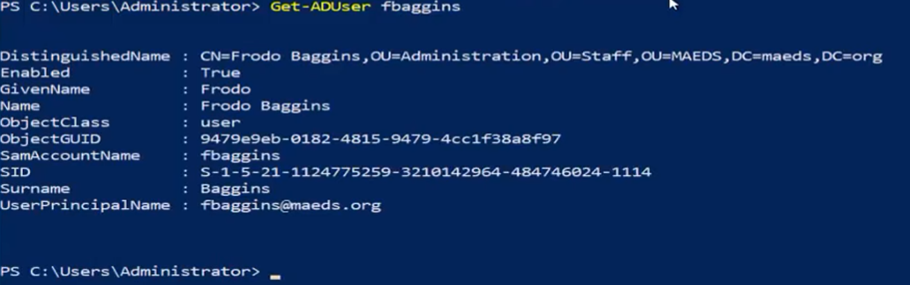
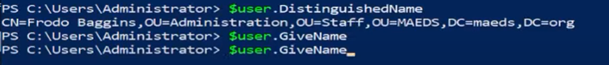
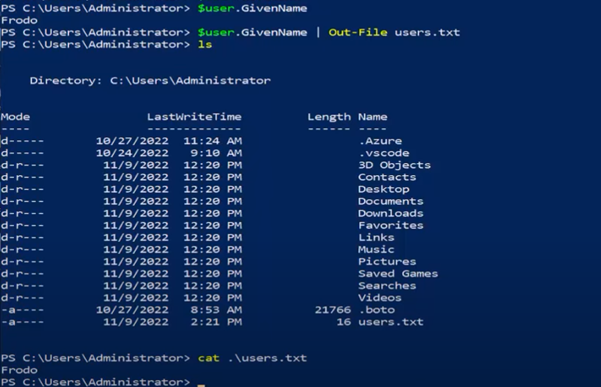
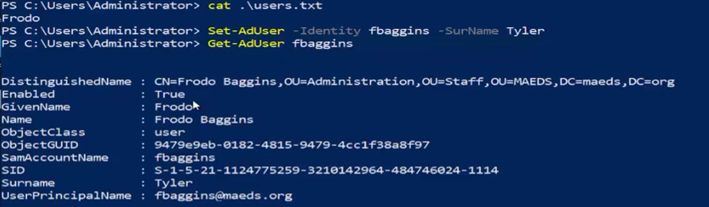
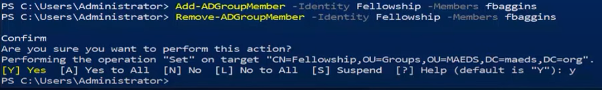
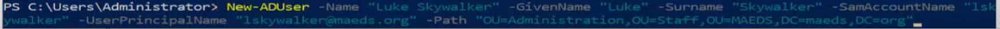

Firstly we want to import Active Directory Module:

Get-ADUser:

We can make users variables and then use variables:

Adding/Removing a User to a Group:

Adding a new user:

When creating a password we need to use a secure string
    -AccountPassword(ConvertTo-SecureString "Password") 

