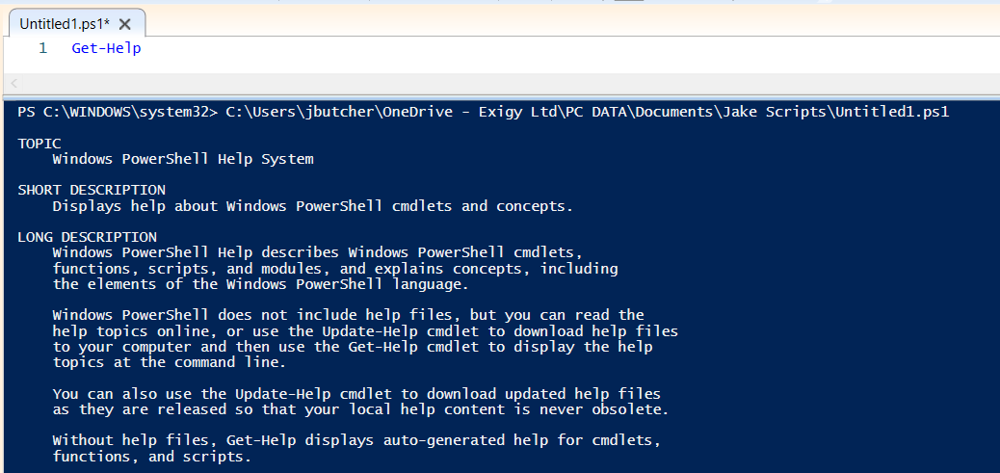
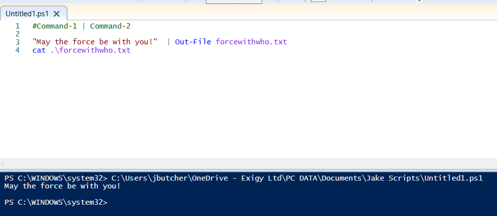

VERB-NOUN formatting:

Locate a command
Locate commands by running the Get-Command cmdlet. This cmdlet helps you search all of the cmdlets installed on your system. Use flags to narrow down your search results to just the cmdlets that fit your scenario.

    - Run the command Get-Command with the flag -Noun. Specify File* to find anything related to files.

Get Help
Locate help for specific cmdlets using Get-Help 

Piping Commands
Piping Commands allow you to combine commands into pipelines (like chains)

