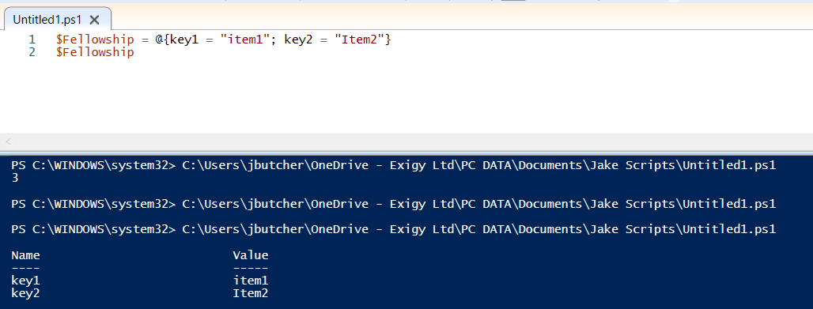

You can create keys for all entries in a list by using {} instead of () in Powershell:

We can also:
Append to these by doing $Variable.Add(key3 = "Item3")
Amend by doing $Variable.Set_Item(key3 = "Item4")
Remove by doing $Variable.Remove(key3)
