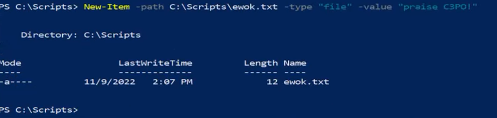
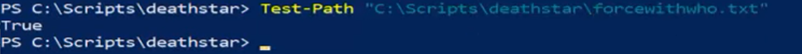

We can use New-Item -path "Path" -type "file" -value "Name"

---

Amending Files:

Use Copy-Item "File Path" - destination "Path File"

And Move-Item to move it

Or Remove-Item

Or Rename-Item

Test-Path allows us to call a file path and check if files are there (Returns Boolean):

