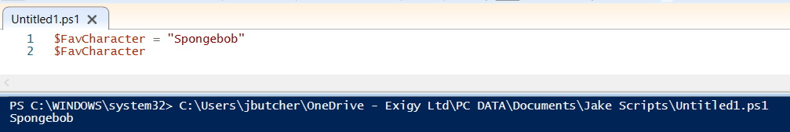
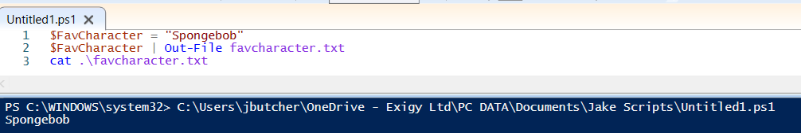
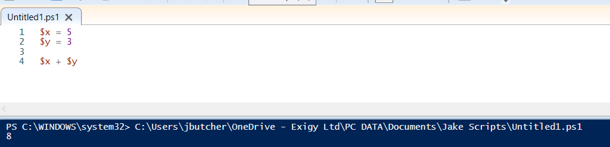
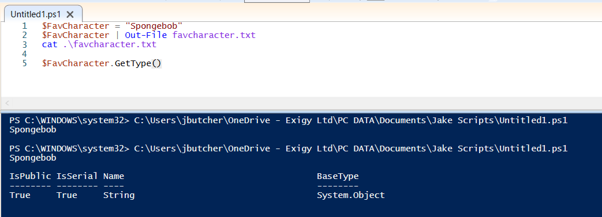

You can invoke variables using $

We can then pipe this variable into an output file:

PowerShell supports Strings, Integers, Floats, and Booleans (Boolean is True/False or 0/1)
We can use $Variable.GetType() to check this:

