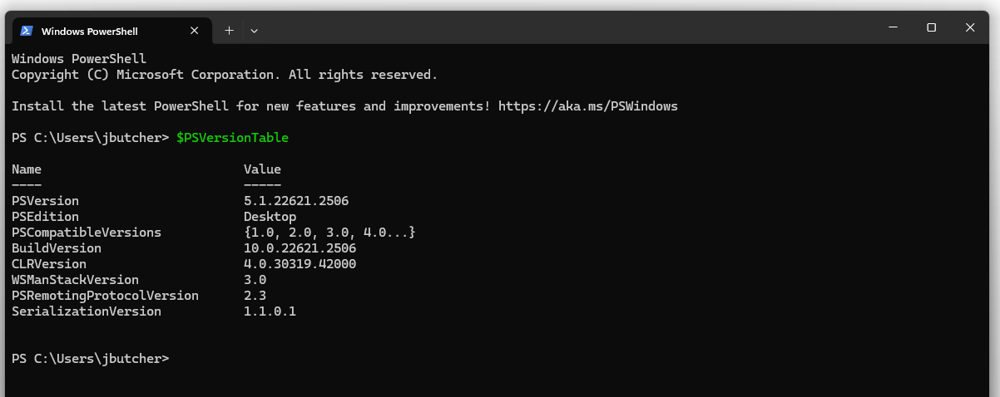
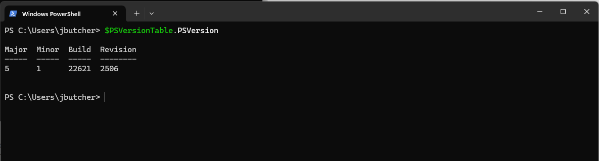

https://learn.microsoft.com/en-us/training/modules/introduction-to-powershell/3-exercise-powershell

Run the following command in Cloud Shell, and then press Enter to verify that your system is set up to use PowerShell. The $PSVersionTable verifies your installation.

The output provides information about your PowerShell version, and your platform and edition.
For information limited to your version of PowerShell, you can run a modified version of $PSVersionTable
Run the following command in Cloud Shell, and then press Enter.

$PSVersionTable.PSVersion

Your output now resembles the following table:

This output gives you more details about your version of PowerShell.
Running $PSVersionTable results in output that looks like a table, but is actually an object. For this reason, you can use a period (.) to access a specific property, such as PSVersion.
