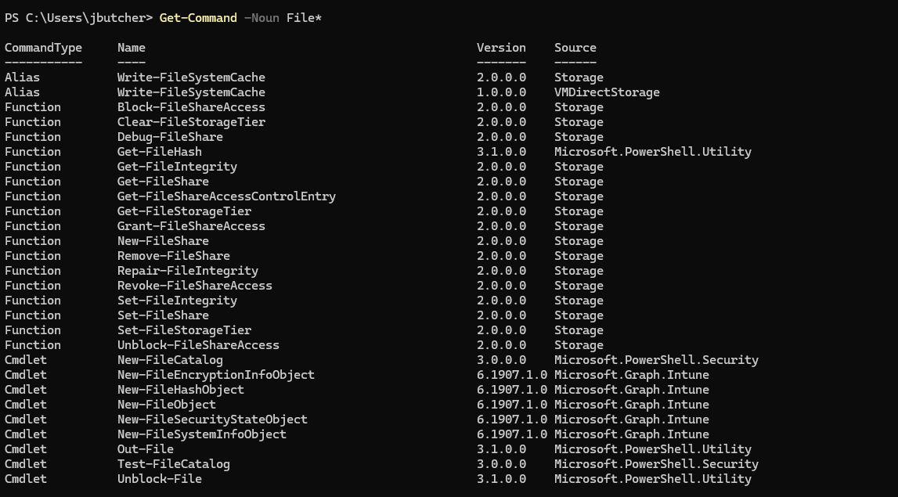
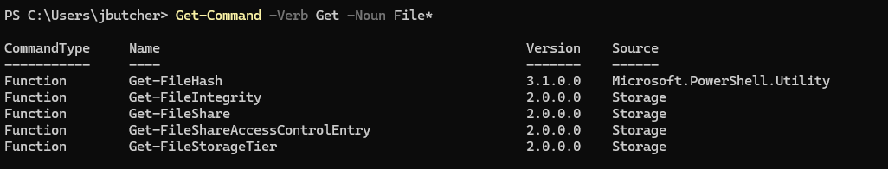

Locate a command
Locate commands by running the Get-Command cmdlet. This cmdlet helps you search all of the cmdlets installed on your system. Use flags to narrow down your search results to just the cmdlets that fit your scenario.
In this scenario, you're looking for a cmdlet that can help you work with files.

    1. Run the command Get-Command with the flag -Noun. Specify File* to find anything related to files.
    

    The cmdlets Get-FileHash, Out-File, and Unblock-File all match your query. Now, you have a manageable response. To further filter the response, add the -Verb parameter to your query.
    
    
    2. Run Get-Command. Specify the flags -Verb and -Noun.
    

    
    This time, only one record matches your search, because you specified both the -Noun parameter and the -Verb parameter.
    
    
    Because the domain you work in is file management, you specified File as the noun. If you know what you want to do within that domain, you can specify -Verb parameters. By using one or possibly two parameters, you can quickly find the cmdlet you need.
     
    
    
