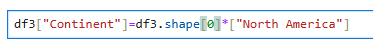
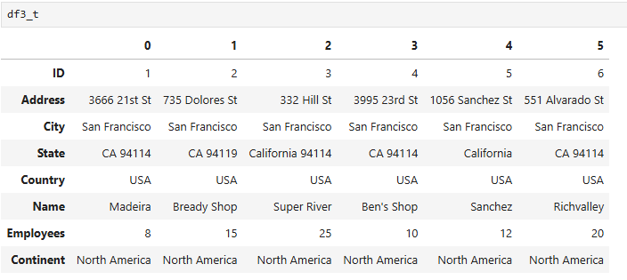
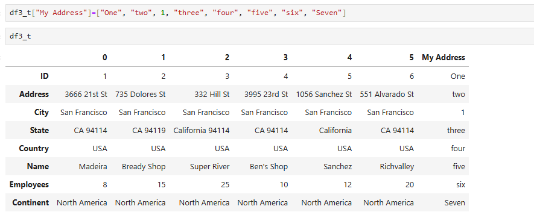
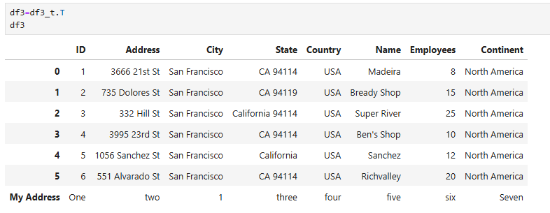
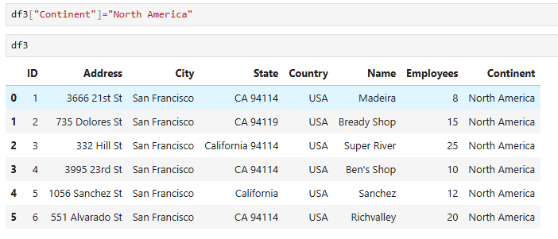
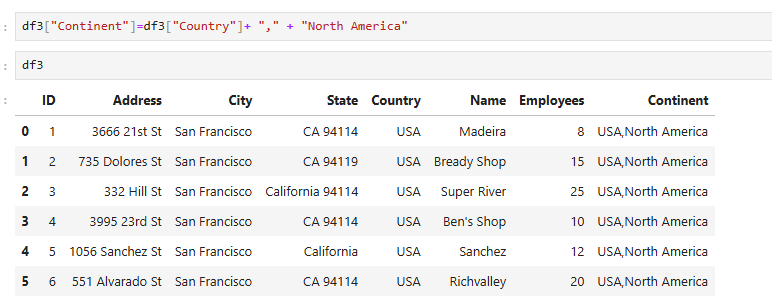
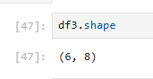

To add a column:

We call DF["Header"]=DF.shape[0]*["DATA"]
This is because our rows are index of 0 in the tuple in df.shape

**Note this is inplace and will change data permanently

---

To add a row it is slightly harder:

We have to call df.T to swap the rows and columns

We then add a column with our data

And then swap them again using df.T

---

To change data in  a column:

Example 2:

We call  DF["Column Header"]=DF["2nd Column Header"] + "string" + "string2"

---

df.shape:

This code gives you the shape (rows / columns) of your data frame in a tuple
