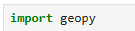
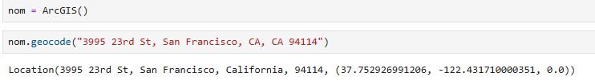
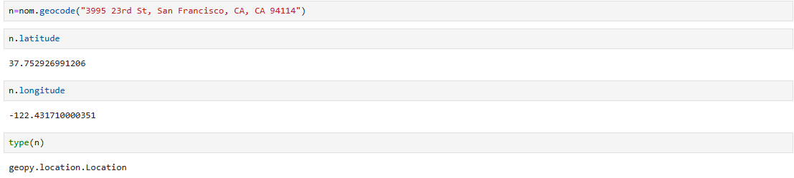
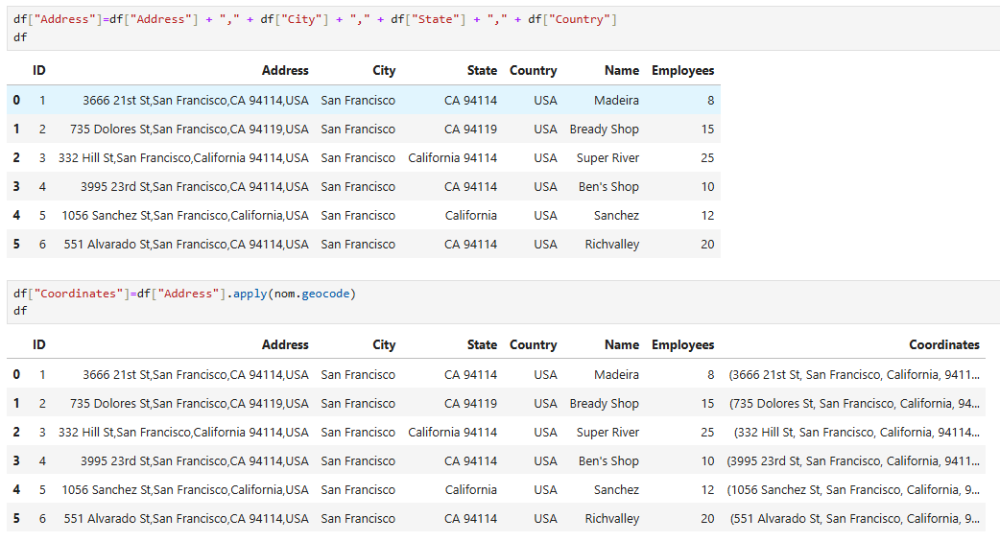

Data Analysis Example: Converting Addresses into Coordinates

 Using geopy (ArcGIS)

Find Latitude / Longitude:  (Stored in variable 'n')

Find Coordinates for multiple rows:

First we need to create a column with all the info needed by geopy:

We then call df["Coordinates Column"]=df["Info Column"].apply(nom.geopy)

If we want only the latitude / longitude:

We need to use lambda and store .latitude in a temp variable (x)

    1. df["Latitude"]=df["Coordinates"].apply(lambda x: x.latitude) 
    2. Df

If there is None Value (invalid address) we can add an if function:

df["Latitude"]=df["Coordinates"].apply(lambda x: x.latitude if x != None else None) 
df

