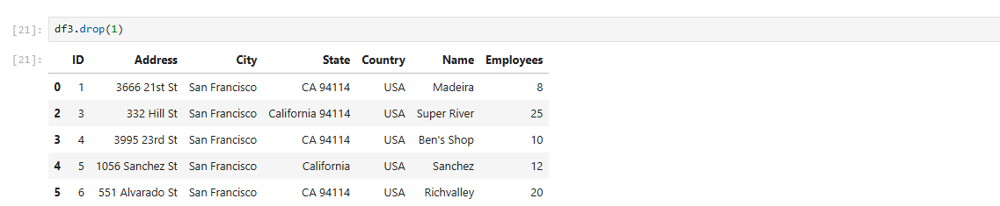
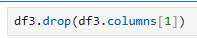
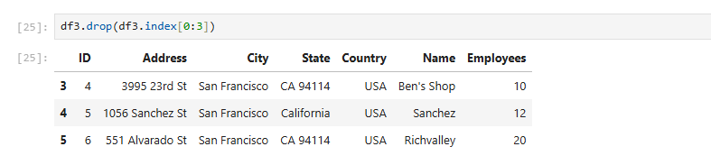

To drop columns/rows: df.drop(Index Number) - example below misses row 1:

**Note that this does not save to the data - this is only shown as an instance

This can also be done using row Indexes:

