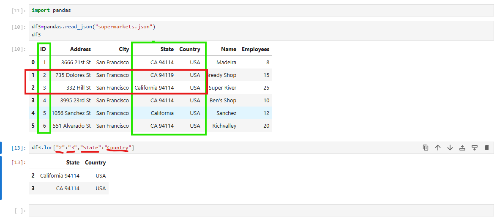
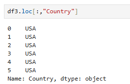
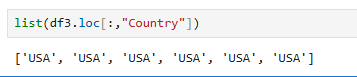
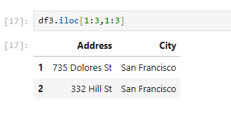

To understand Indexing - we can try and use df.loc to locate specific data in a dataframe:

This allows us to use ["Row":"Row","Column":"Column"]

---

We can also search entire rows / columns:

And also make this a list using Python built in function:

This can also be done with df.iloc and using row / column numbers:

