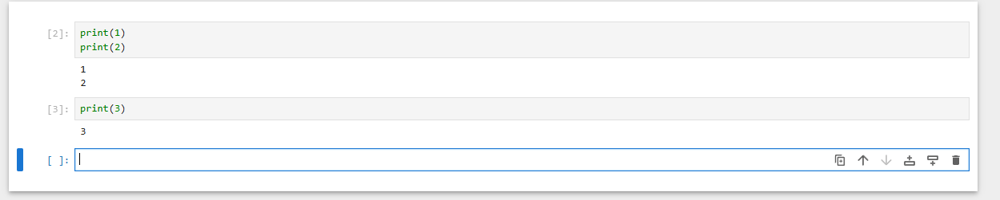

In a Jupyter notebook you can have multiple lines of code in a cell

Enter = new line in cell
Shift + Enter = run code in cell
Alt + Enter = new cell
D + D = delete cell

*To select a cell hover mouse + enter
