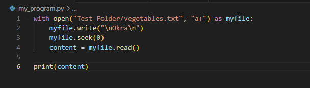

We can append using "a" and to make it readable we can add "+"

However since we are appending before reading, we add .seek(0) to put the cursor back at line 0

 ------------ Character Meaning ------------

'r' 	Open for reading (Default)
'w'	Open for writing, truncating the file first
'x'	Create a new file and open it for writing
'a'  	Open for writing, appending to the end of the file if it exists
'b'	Binary mode
't' 	Text mode (Default)
'+'	Open a  disk file for updating (reading and writing)
'U'	Universal newline mode (deprecated)
