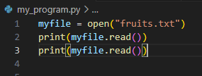
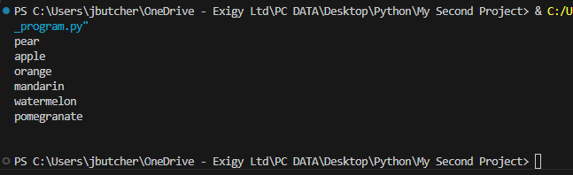
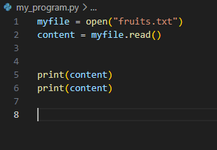

When we apply the .read method - the cursor starts from the beginning and finishes at the end.

This means that if we try to print again after the first execution, it will not return the contents again:

To work around this - we can store the read function in a variable (content) so the function is only used 1 time

