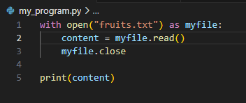

We can open, action and close a file using the "with" function:

*note the with will close the file automatically - the above myfile.close is not needed

This helps as any actions done on the file are stored in an indent, therefore easier to read
