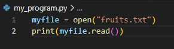

To read a file in Python, we first have to store the file path in a variable (in the below it is in the same directory as the .py so only the file name is used)

We then have to specify to read the file (.read() doesn’t take any arguments)
