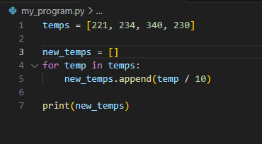
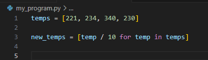

If we needed to divide data in a list by 10, and output in a new list, we could do this:

Or with list comprehensions we could do this instead:

This was we don’t need to do a for loop, we have an inside for loop
