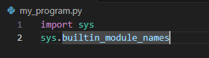
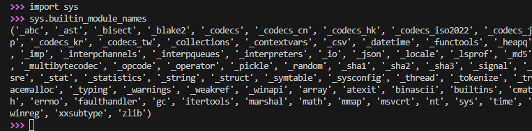
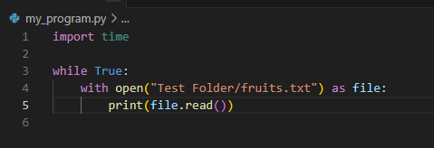
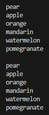
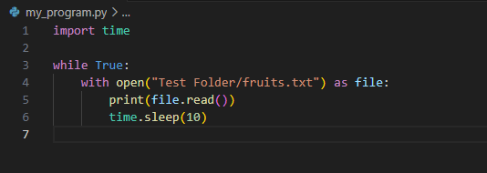

To check built-in functions dir(__builtins__)

But some functions don’t exist

We can import built-in modules

Example****

If we want a read function, this below will loop too quick, but there is no default way to slow this down

So we import time, and use the .sleep function

This will now wait 10 seconds at the end before starting the loop again
