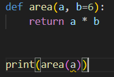

Default parameter is a and non-default parameter is B:

This shows b as a default parameter

However, you can still assign a different value to b through doing b=7 or by just doing print(area(3, 7)

***A default parameter cannot be before a non-default parameter

