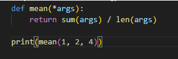

Some Functions take different amounts of arguments (For example isinstance takes 2, and print takes infinite)

The above is a function with an arbitrary number of non-keyword arguments only using *args

(x=3 would not work)

If we wanted to define a function that takes an indefinite number of strings:
(includes sorting alphabetically and capitalizing)

def foo(*args):
    args = [x.upper() for x in args]
    return sorted(args)
