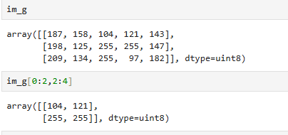
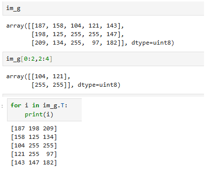
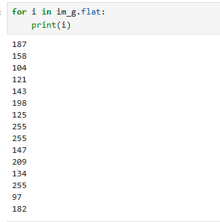

Slicing Arrays:

We can slice arrays, the same way we would slice a list (variable[column index, row index])

Indexing Arrays:

Iterating Arrays:
.flat allows you to access values in an array 1-by-1

