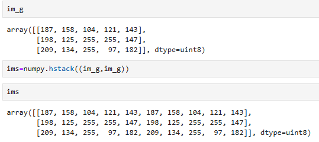
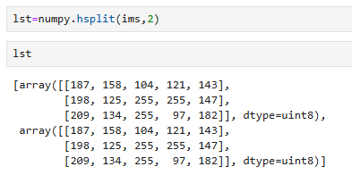
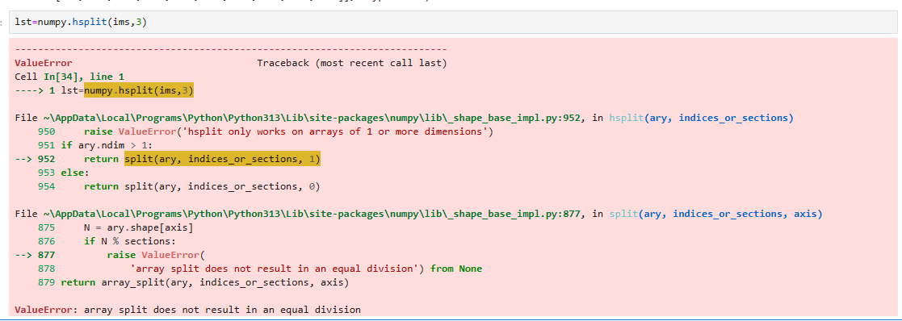

Stacking Arrays to each other:

We could use numpy.hstack (Horizontal Stack) or numpy.vstack (Vertical Stack), and store the arrays in tuples, as vstack / hstack only take 1 argument:

**Note they will need to be same number of dimensions

---

Splitting Arrays from each other:

We can do the opposite using hsplit / vsplit: 

Note that the 2nd argument is the divison - they will need divide into equal arrays (number of columns/rows):

