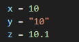
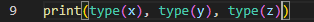

Below shows example of Integer (x), String (y), and Float (z)

*note that you can use single quote for string

**int will truncate decimals

You can use Type function for these variables to confirm:

Output:

