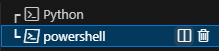
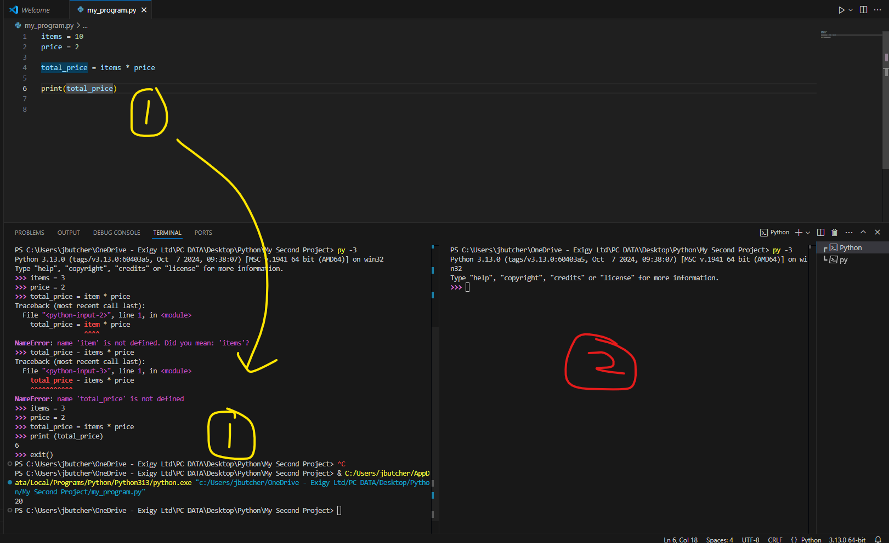

Split Terminal using the book icon

This allows you to have a terminal for the py file, and a separate py terminal for quick coding
Example below shows 1 replicated in a terminal, and 2 being a separate terminal

To clear Terminal: (only command line, not python shell)
cls
