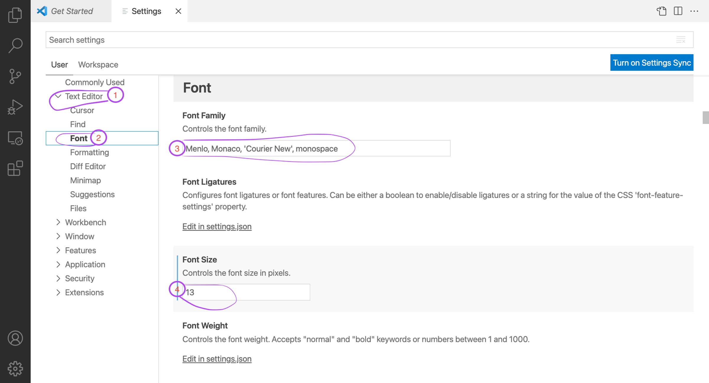

Ways of understanding data because it gives names to values

Below shows an example of variables (spent / donated / total amount)

It is also possible to print out multiple variables in one single print function by using commas between the variables. The last line of the code below contains an example:

Output: 20 10 2

Syntax Rules:
    - Unable to put numbers infront of variables (e.g. 2items)
    - Can add numbers in variables (e.g. it2ems) or behind (items2)
    - Can use underscores but not spaces
    - Amount of spaces unlimited, but recommended to add one space 
    
