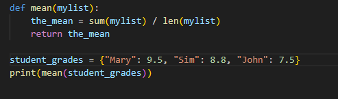
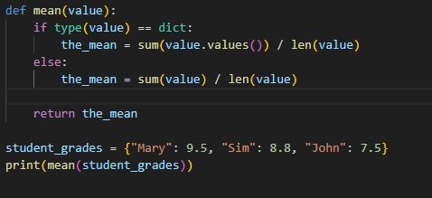
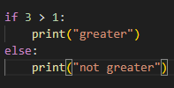

This function currently only returns an error as the "mean" defined function will not work with the dictionary. However, we can make this work with conditionals

This code has added the "if" function, we are then using == dict: to say "if the variable is a dict, use this" 

We are then using sum(dict.values()) / len(dict) 
This will work out the average (dict is defined in your def function)

Once we are done with this part, we use else: to say "if this is not a dict, do this instead"

The above conditional example happens to be in a function, but conditionals can also be outside of functions, example:

This will check if true
e.g. the same as:
>>> 
if True:
    print("Greater")
else:
    print("Not Greater")
    
*** Greater

Also better to use this intead of if type():

if isinstance(3, int)
