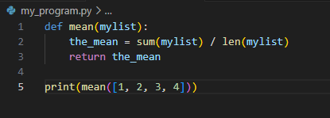
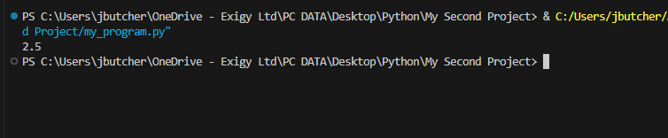
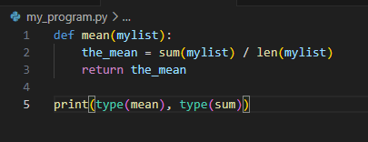
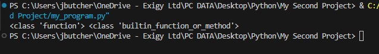
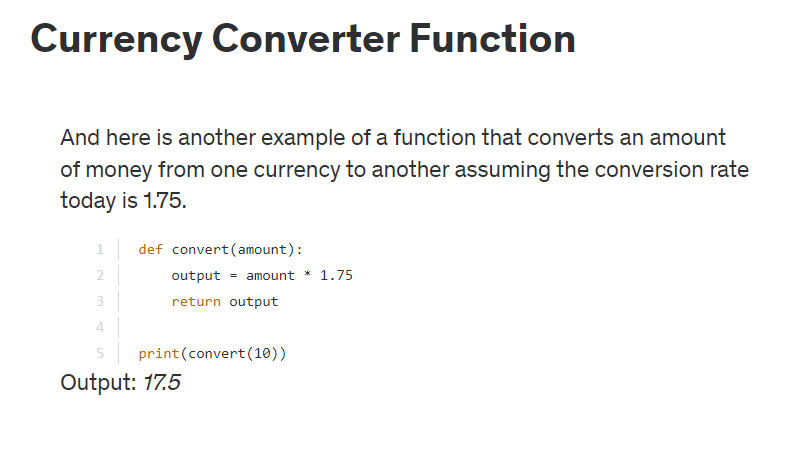

We can use the def function to create (and define) our own function.
For example, Python doesn't have a built-in average function, so we can create our own:

We have now created the 'mean' function by defining what the function should do (in this case sum() / len())

Result:

This can be seen by doing type(mean):

Result:

