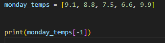
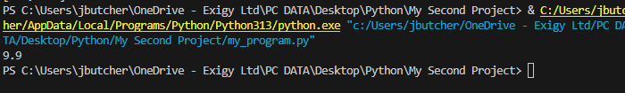
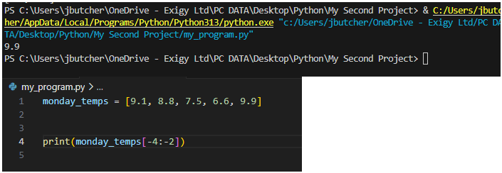
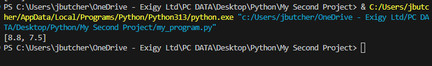

Instead of counting to what intex a value is on a list (for example below 9.9 is '4'), you can use negative indexing to being from the end of the list, for example 9.9 is also '-1'

Example:

Result:

This can also be done for slices:

Result:

