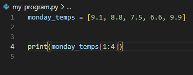
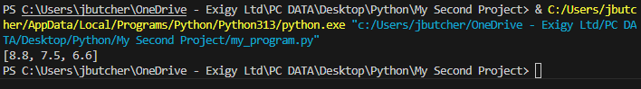
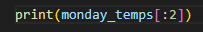
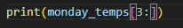

You can access portions of a list using a similar function to __getitem__ or []

Example:

Result:

Item 0 and 5 are not shown

You can also do the below to start from 0

Same for starting from a mid-point to the end of the list

