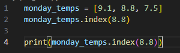
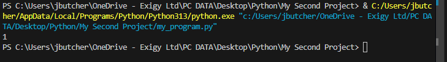
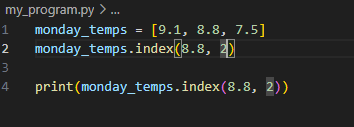
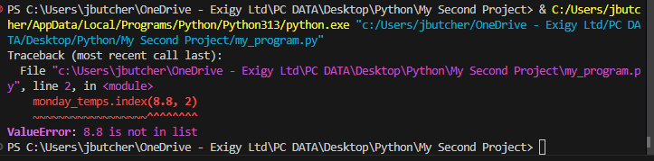

Index will search a list for a certain value. For example in the below, it will search for 8.8 in the list
*Also note that it will search from the beginning of the list

Result: 

It shows the amount of items in that list with the given value.

--------------------------------------------------------------------------------------------------------------------------------------------

You can also search by steps, by using a comma in the syntax

Example:

Result:

In this case an error is shown, as the value is skipped so no 8.8 is returned.
