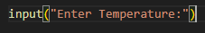
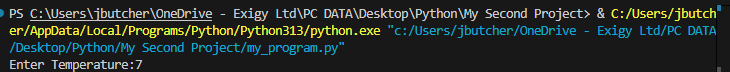
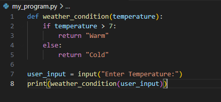
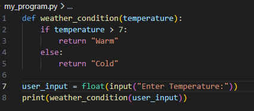

You can use the "input" function for a user to interact with the program: 

Result: (User types 7)

To utilize this we can put it in a variable

*note the the user's input is always treated as a string
To resolve an issue (for example can use ">" between an int and str) we can make it a float:

Int() would also work, but for this example it is bad because the user could input a decimal and get an error
