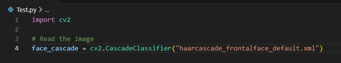
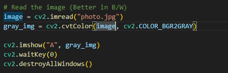
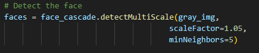
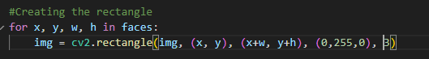

First we want to store a cascade clasifier object in a variable:

    We can use cv2.CascadeClassifer() and pass the XML Cascade

Then we want to read the image (Usually easier to detect in grayscale)

We then want to use .detectMultiScale to detect the face:

    We also pass a scale here (how python reads the image) which is more accurate if smaller
    And we pass minNeighbors (Tells python how many neighbors to search around the window)
    

Then to create the rectangle around the face:

The for loop contains an updated img variable:
Passing (image, (coord, coord), (coord +width, coord+height), (B, G, R), (width of rectangle)
