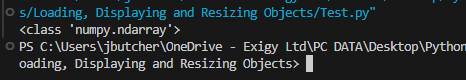
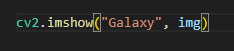
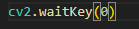
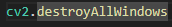
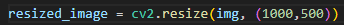
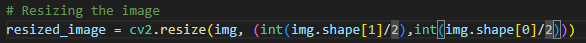
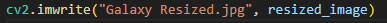

img = cv2.imread("Image Name", 1)

Passing cv2.imread:
If we want to use GBR, pass 1
Greyscale, pass 0
Color image with alpha (Transparency), pass -1

cv2.imread type:
The type of the image is a numpy array:

If we want the resolution we can pass print(img.shape)
Or dimensions by passing print(img.ndim)

To show image:
    1. We pass the title of the window that will be created, and then the variable that we stored the image in.

    
    2. We also need to specify a time for the window to close:

The time is indicated in milliseconds, or if we pass 0 the user can press any key to close

    3. We pass a function for what happens when the window closes:

To resize the image:
We need to pass cv2.resize(photo variable, (Res, Res)) - *before showing image

Input the resolution in a tuple

If we want to keep the ratio of the image:

We use img.shape and amend from that (Keep the type as INT or else you get an error) and use the index for the shape resolution (i.e 1920 [1] x 1080 [0])

To write an image:
cv2.imwrite("name", imaged variable)

