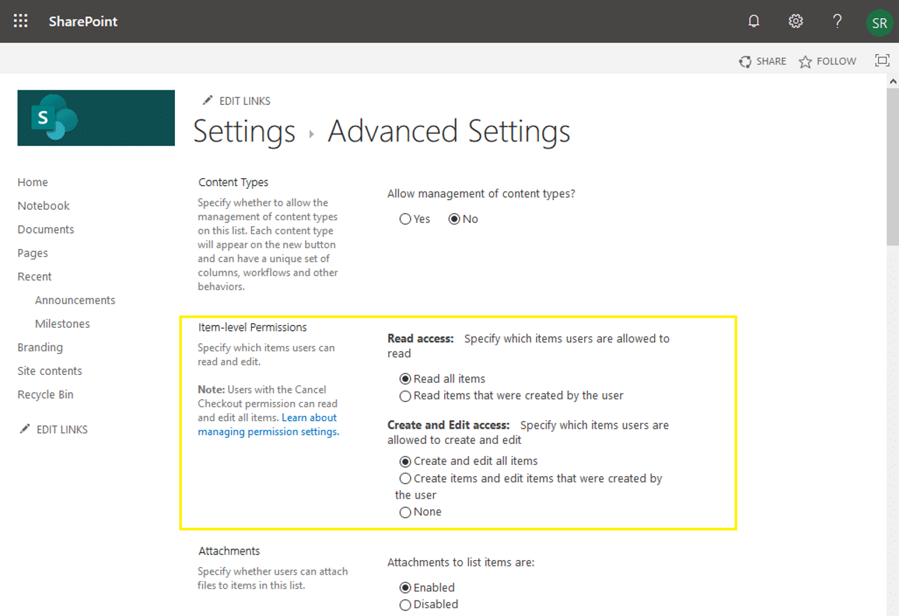

These permissions give you the ability to restrict all items in a list either with read or edit access to only those who created that item, You can utilize Item-level permission settings in SharePoint Online. (Although you can filter the list view with “Created by” equals [Me]” it doesn’t actually hide the list item in places like “Search”).

To set Item-Level permissions for a list:
1. Navigate to your SharePoint Online List >> Click on Settings Gear >> List Settings
2. Click on the “Advanced Settings.” link.
3. In the Advanced settings page, under “Item-Level Permissions”, you can set Item-level settings. By default, Item-level permissions settings are set to:
    • Read all items –  Anyone who has access to the list can view all items!
    • Create and edit all items – Anyone who has access to the list can create items and edit all items (even if it’s created by someone else!)

• Read items that were created by the user – When you set this option, users will only get to see items they created. They won’t see other’s entries. The list views show only items created by the user.
• Create items and edit items that were created by the user – When this is checked, users will be able to create items, but they’ll only be able to edit items they created. If a user tries to edit items created by other users, they’ll get a “Sorry, you don’t have access” error.

Item level settings don’t affect anyone with “Discard Checkout Permissions” – It controls only users with Contribute and Edit Access. Users with the Cancel Checkout permission can read and edit all items regardless of the above settings –  So, the Permission level of “Design” or above overrides these settings!

From <https://www.sharepointdiary.com/2019/05/sharepoint-online-set-item-level-permission-in-list.html> 
