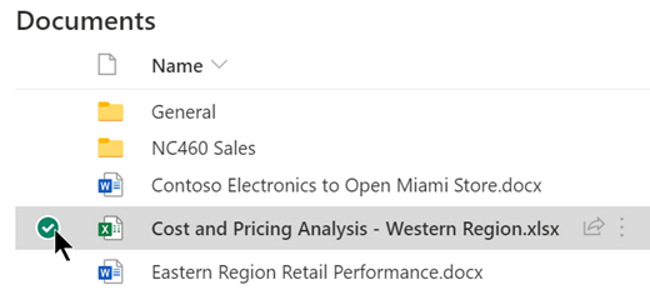
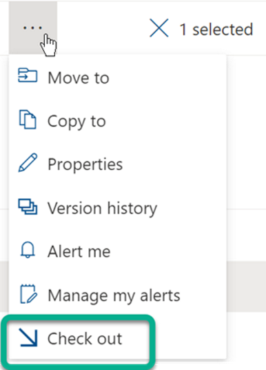
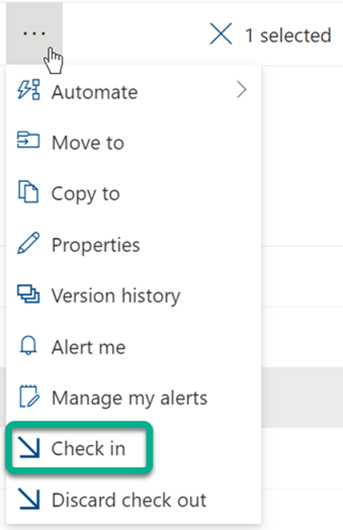

Check out files
Some libraries are set up to require checkout of files. If checkout is required, you will be prompted to check out any files that you want to edit. When you are finished with the file, you need to check it back in or discard the checkout.
If checkout isn’t required in the library, you don’t need to check it out as long as you don’t mind letting other people edit at the same time as you.

From <https://support.microsoft.com/en-us/office/check-out-check-in-or-discard-changes-to-files-in-a-sharepoint-library-7e2c12a9-a874-4393-9511-1378a700f6de> 

Check out from the SharePoint document library

1. Go to the library where your file is saved. If you’re looking at a view of the library on another page, you may have to click the title of the library first. For example, you may have to click Documents first to go to the Documents library.

2. Select the file or files that you want to check out.

3. Above the Documents list, select the three-dot menu, and then select Check out.

Notes: 
    ○ When the file is checked out, a small icon  

    
    
       appears to the right of the file name. This tells you, or anyone else, that the file is checked out. If you point your mouse at the file name, you can see details about the file, including the name of the person who has it checked out.
    ○ In the classic experience, Check Out is on the Files tab of the ribbon.

From <https://support.microsoft.com/en-us/office/check-out-check-in-or-discard-changes-to-files-in-a-sharepoint-library-7e2c12a9-a874-4393-9511-1378a700f6de> 

---

Check in files
A file you check out, and any changes you make to it, won't be available to your colleagues until you check the file back in to your library.
If you downloaded your document to work locally, you'll want to upload it before checking it in. 

From <https://support.microsoft.com/en-us/office/check-out-check-in-or-discard-changes-to-files-in-a-sharepoint-library-7e2c12a9-a874-4393-9511-1378a700f6de> 

Check in from the SharePoint document library
    1. Go to the library where your file is saved. If you’re looking at a view of the library on another page, you may have to click the title of the library first. For example, you may have to click Documents first to go to the Documents library.

    2. Select the file, or files, that you want to check in.
    

    3. Above the Documents list, select the three-dot menu, and then select Check in.

    
    
    Note: In the classic experience, find Check In on the Files tab in the ribbon.
    4. In the Comments area, add a comment that describes the changes you made. This step is optional but recommended as a best practice. Check-in comments are especially helpful when several people work on a file. Moreover, if versions are being tracked in your organization, the comment becomes part of the version history, which may be important to you in the future, if you need to restore to an earlier version of the file.
    5. Click OK. The green arrow disappears from the file icon when the file is checked back in.

From <https://support.microsoft.com/en-us/office/check-out-check-in-or-discard-changes-to-files-in-a-sharepoint-library-7e2c12a9-a874-4393-9511-1378a700f6de> 

