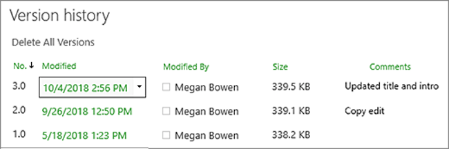
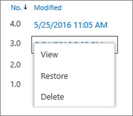
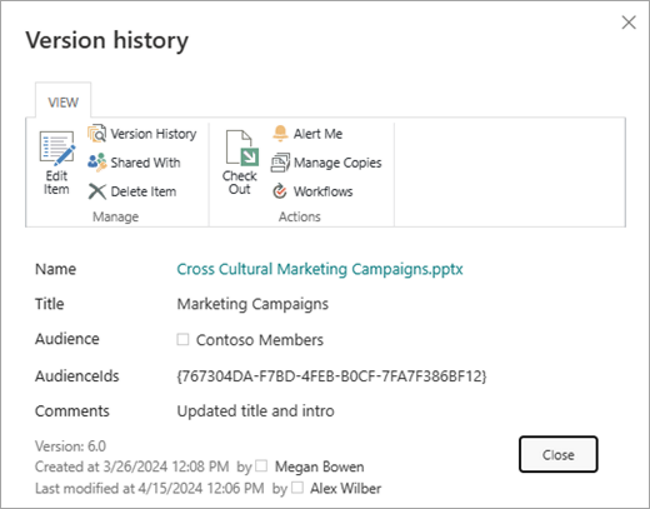
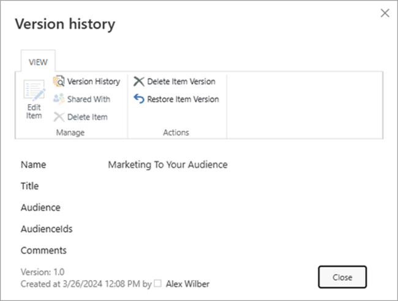

When versioning is enabled in your list or library, you can store, track, and restore items in a list and files in a library whenever they change. Libraries can track both major versions, such as those in which a new section was added to a document, and minor versions, such as those in which a spelling error was corrected. Lists can track only major versions. For more information on versioning. Effectively, versioning provides a safety net.

From <https://support.microsoft.com/en-us/office/view-the-version-history-of-an-item-or-file-in-a-list-or-library-53262060-5092-424d-a50b-c798b0ec32b1> 

To do this…	I need this permission…
View version history	Full Control, Edit, Read
Restore a previous version	Full Control, Edit
Delete a version	Full Control, Edit
Un-publish a version	Full Control, Edit
Recover deleted a deleted version	Full Control, Edit

From <https://learn.microsoft.com/en-us/microsoft-365/community/versioning-basics-best-practices> 

1. Open the list or library from the Quick Launch bar.
If the name of your list or library does not appear, click Site contents or See all, and then click the name of your list or library.
2. Right click on the space between the item or document name and date, and then click Version history from the menu. You might need to scroll the menu to see Version history.
If you don't see Version history, click the ellipsis (...) in the dialog box and then click Version history.
You'll see a list of versions of the file.

3. In the Version history dialog box, hover next to the version you want view and click the down arrow on the right side to get a list of options.

Click View.
Note: For all document versions except the latest, you'll see View, Restore, and Delete. For the latest version, you'll only see View and Restore.
4. The Version history dialog box opens with various actions you can select.
The actions available vary with version and with attributes that are set up by the administrator or owner.
The choices change based on whether you selected the latest file, or an earlier version.
The Version history window for the most recent version of the file includes actions to manage, notify, check out, or create a workflow.

The view of the version history for a previous version of a file shows the option to restore or delete that version.

From <https://support.microsoft.com/en-us/office/view-the-version-history-of-an-item-or-file-in-a-list-or-library-53262060-5092-424d-a50b-c798b0ec32b1> 

