# What is a SharePoint View?

In keeping with the theme of this series—we’ll start at the beginning by explaining what a SharePoint View actually is. Views add another dimension to the organizing of [your SharePoint list and library content](https://sharegate.com/blog/sharepoint-lists-evolving-guide-to-microsoft-lists#list-making) so that you can find the right piece of data when you need it, without having to dig through hundreds of items.

With views, you can use filters and styles to show, in different ways, the information available in your lists and libraries. There’s always a view activated in your list or library. The automatic standard view selected is normally “all items”. This type of view is the basic display you are probably already familiar with.

From <https://sharegate.com/blog/what-is-a-sharepoint-view-and-how-to-use-it> 

Benefits of SharePoint Views

Avoid Data Buildup & Bottlenecks
Views allow the user to sort and organize data logically and coherently.

Access and Organize the Data You’ve Filed Neatly Away
Views allow you to filter the content in your list or library without creating a flood of folders. This lets you see prioritized content that you’ve organized in a list or library clearly. When you create a folder it—in and of itself—becomes a list of items, so the filters you invoke will be blocked from working on the documents in the new folder. And that goes for a filter you create inside the new folder; it won’t work outside that particular folder.

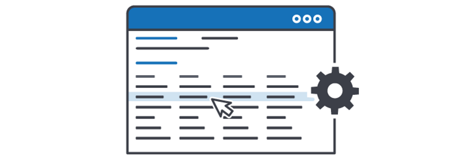

In addition to offsetting issues around folders, views are quite a powerful tool within the SharePoint platform. They give you the ability to design customized and specific views, and altogether make your SharePoint a lot more coherent and understandable. Along with different types of views, you can employ filters and styles to display the information in your lists and libraries.
Imagine your business needed to set up a new payment. In SharePoint you can set up a payments list with views for payments made, and a filter to view payments outstanding. You could also set your list to view payments of a specific range of figures, when they need to be paid, or when they were successfully paid. So, when you need to keep a tally on incomings and outgoings, your information is all at hand, right in front you.

Types of SharePoint Views

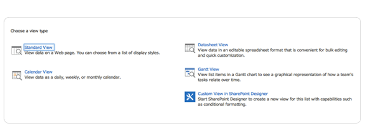

Standard View
This is the view you see when first creating a list or library. The view showcases your list information in an Excel-like table (you are unable to edit the list right away), with the columns you chose along with it, like First Name, Last Name, DOB, etc. And it is pretty straight forward.

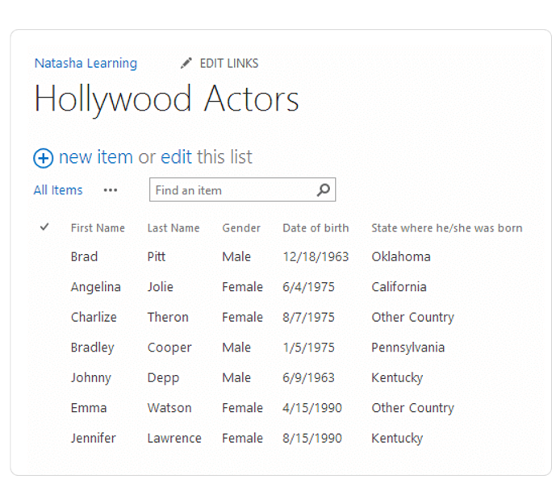

Calendar View
Essentially, this view is also a list (as almost everything in SharePoint is) masquerading as a calendar. It means that you can turn any list of information into a calendar, or at least any list that contains dates. You can decide which column you want to display on your calendar for a week, a month, a day and so on.

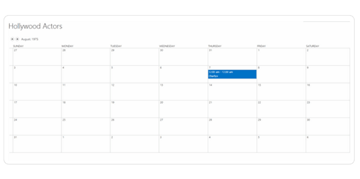

Datasheet view
Similar to the standard view, the difference here is you can bulk edit all items in this Excel-type view directly on the page. If you’ve ever had to edit employee timesheets, you’ll understand how this can be a great benefit.

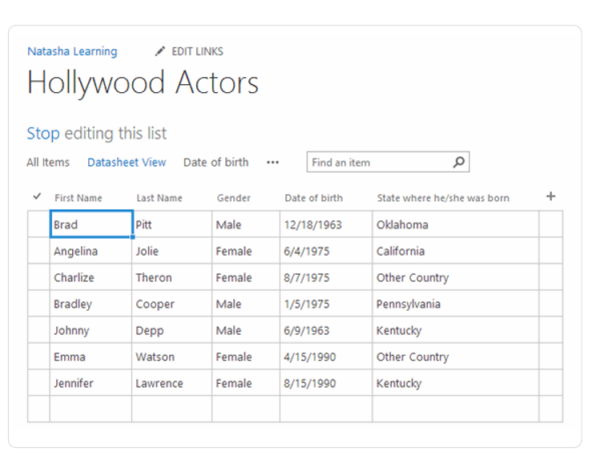

Gantt view
This is another view that is centered around dates and time. A Gantt chart documents progress of a number of components in time. This would be good for tracking deadlines for invoices or payments coming in, or for other projects that are subject to deadlines and/or progress reports.

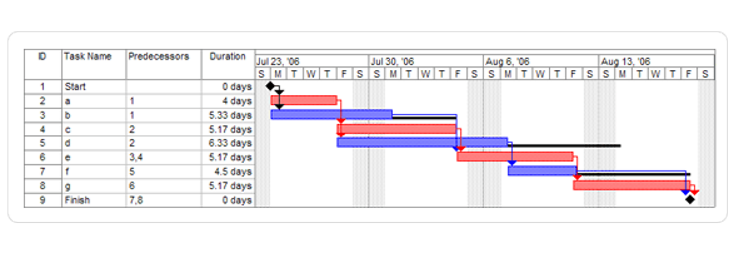

Styles for the Standard view

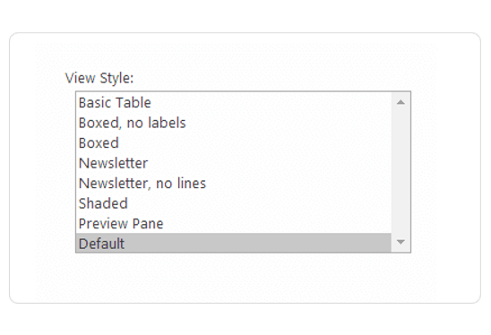

The options shown above give your standard list a new look. They won’t modify any of the list’s content, they’ll just present the content in various styles. Below are some examples of how your view would look with a specific style attached to it.
Boxed

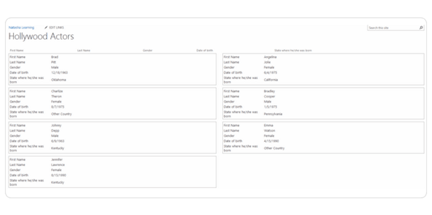

Newsletter

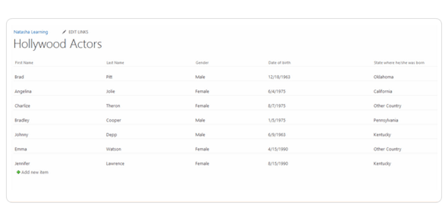

Shaded

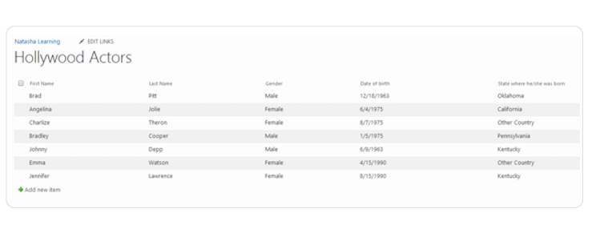

Preview pane style
This style is interesting and helpful because, when you hover over the title of an item, the details of the item appear beside the list of titles. This way, you see only the information about one item, instead of all the items like in a normal table.

How to create and modify a SharePoint view?
Creating and modifying views in your lists and libraries is actually quite simple. You’ll find the option in the ribbon at the top under list/library. The section is called “Manage Views”.

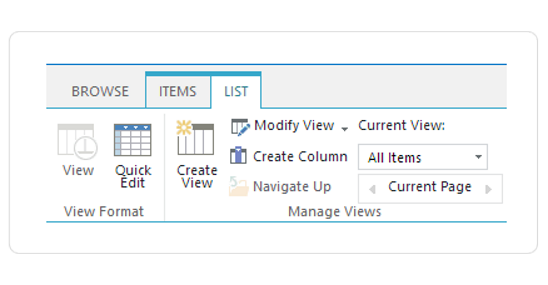

Modify a View
You can modify the view you’re currently using by clicking on “Modify View”. At this point your original settings will appear, and you’ll be able to change them. 

Create a view
This is a choice in the same place as « Modify View ». To create a new view for your SharePoint list or library you simply need to click on « Create View » and what you’ll see at first is the different view types, and you can also choose to make your view Public or Private.
When you decide to make it public, everyone that goes on the list will see it. If you make it private, you’ll be the only one who sees this view when you look at the list or library.

From <https://sharegate.com/blog/what-is-a-sharepoint-view-and-how-to-use-it> 
